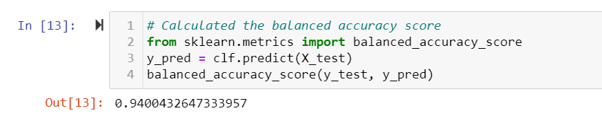
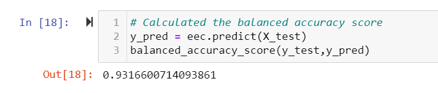
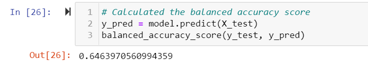
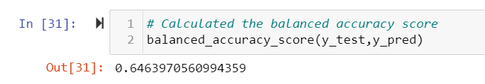

# Credit_Risk_Analysis
## Overview of the analysis
We are using machine learning to evaluate credit card risk

## Results
Looking at the 6 different supervised machine learning models we got:  
Balanced Random Forest Classifier 94%  
  
Easy Ensemble AdaBoost Classifer 93.2%  
  
Naive Random Oversampling 64.6%  
  
Smote Oversampling 64.6%  
  
Cluster Centrolds 64.6%  
  
Combination of over and under using SMOTEENN 54.4%  

## Summary
Based on the above results, we can determine the best supervised machine learning model would be Balanced Random Forest Classifer. 
